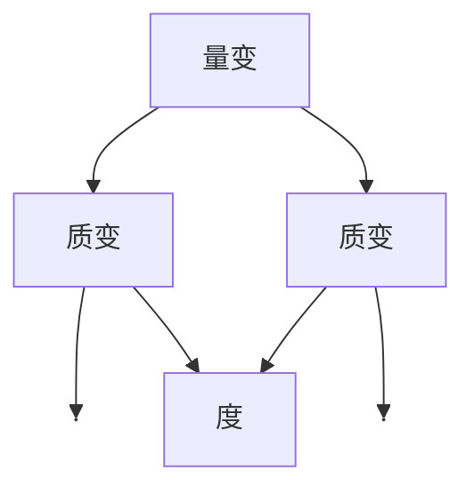
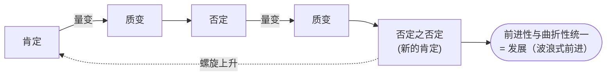

# 马克思主义哲学笔记

## 一、马克思主义的构成

- **本体论**(费尔巴哈)→ 唯物主义
- **方法论**(黑格尔)→ 辩证法
- 不是简单相加，而是革命性改造 → **辩证唯物主义和历史唯物主义**
- 三个基本组成部分：
    - 马克思主义哲学
    - 马克思主义政治经济学
    - 科学社会主义
- **四个特性**:
    - 科学性
    - 人民性（本质属性）-+
    - 实践性（基本观点） +->革命性
    - 发展性-------------------+

## 二、本体论

**思维(意识)与存在(物质)**

 - **第一性**(何者为第一性) 
   - 唯物 
      - **古代朴素唯物主义**:把物质等同于水、火、气等具体物质形态；直观猜测，有合理性，但把物质与具体形态混同
      - **近代形而上学唯物主义（机械唯物主义）**:把物质等同于原子；以自然科学为基础，但机械、孤立、静止，历史观上仍唯心
      - **马克思主义唯物主义（辩证唯物主义和历史唯物主义）**:物质是标志客观实在的哲学范畴；客观实在性是物质唯一特性；唯物论与辩证法统一、自然观与历史观统一
   - 唯心 
      - **主观唯心**:人的主观精神是本原
      - **客观唯心**:世界的本原是某种客观精神
 - **同一性**(思维能否认识存在) 
   - 可知论 ✓ 
   - 不可知论 

- 可知论 ⇒ **实践**
  - ① 思维与存在的关系:思 ⇄ 存(以实践为中介)
  - ② 存在的范围:
    - 自然 ✓
    - **社会**(★重点)⇒ 
        - 物体
        - 社会关系 → **实践** → **物**(客观实在性)
        - 人(人的活动是社会关系的总和)

### 物质

### 1. 物质的根本属性与存在方式

- **运动**(绝对):**物理** + 思维
- **静止**(相对):**物理** + 性质

### 2. 基本存在形式

- **时空**:物理(牛顿的绝对时空)+ 社会性

### 3. 物质与意识的关系

物 —决定→ 意;意 —反作用→ 物

- **(1)决定?** 起源、本质
- **(2)反作用?** 能动性
  - ① 目的性、计划性
  - ② 创造性
  - ③ 改造世界
  - ④ 间接生理/心理作用
- **(3) 主观能动性和客观规律性的辩证统一**
  - ① **尊重客观规律是正确发挥主观能动性的前提**
  - ② **只有充分发挥主观能动性，才能正确认识和利用客观规律**
     - **正确发挥主观能动性的前提和条件**
        - 第一，从实际出发是正确发挥主观能动性的前提。
        - 第二，实践是正确发挥主观能动性的根本途径。
        - 第三，正确发挥主观能动性还要依赖于一定的物质条件和物质手段。

## 三 辩证法（方法论）

- **客观辩证法与主观辩证法**（统一于实践）
  - 客观辩证法：客观事物或客观存在的辩证法（采取外部必然性形式，不以人的意志为转移）
  - 主观辩证法：人类认识和思维运动的辩证法（采取观念的、逻辑的形式，是客观辩证法在思维中的反映，总结我们认识和思维的规律）
  - 【补】二者在本质上是统一的，但在表现形式上不同。

### 1. 两大总特征：联系与发展
- **联系**（定义：事物内部各要素之间和事物之间相互影响、相互制约、相互作用的关系。）
  - 客观性
  - 普遍性
  - 多样性
    - 直接/间接
    - 内部/外部
    - 本质/非本质
    - 必然/偶然
  - 条件性
- **发展**
  - **本质**：事物变化中前进、上升的运动（变化：泛指事物发生的一切改变）
  - **实质**：新事物的产生和旧事物的灭亡
  - 新事物是不可战胜的（适应变化的环境和条件；既否定又保留并添加新内容；社会领域符合人民群众利益）
- **核心问题**：如何联系、发展->三大规律

### 2. 三大规律

#### （1）对立（对立性）统一（同一性）规律（事物发展的源泉和动力）
- **矛盾**：
  - （内在特点）同一性（相互依存、相互转化）与斗争性
    - 同一性：有条件、相对
      - **同一性作用**：
        - 事物存在和发展的前提
        - 双方相互吸取有利因素
        - 规定转化可能和发展趋势
    - 斗争性：无条件、绝对（①自身②全世界）
      - **斗争性作用**：
        - 促使力量发生变化，为质变创造条件
        - 是矛盾统一体过渡的决定性力量
    - 关系：相互联结、相辅相成
  - **方法论**：
    - 在斗争中把握同一，正确把握和谐的作用
    - 在同一中把握斗争，发扬斗争精神
  - （外在特点）普遍性和特殊性
    - **普遍性与特殊性**：
      - 普遍性：事事有矛盾，时时有矛盾(绝对、无条件)
      - 特殊性：不同事物、不同过程/阶段（有条件、相对）
      - 辩证关系：共性寓于个性之中，有机统一

  - **方法论（矛盾普特关系）**：
      - 主要矛盾与次要矛盾、矛盾的主要方面与次要方面（事物的性质由主要矛盾的主要方面决定）
      - 两点论与重点论统一（抓主要矛盾和矛盾的主要方面）
      - “两点论”既要看到主要矛盾，又要看到次要矛盾；既要看到矛盾的主要方面，又要看到次要方面。“重点论”要着重把握主要矛盾、矛盾的主要方面。

#### （2）量变质变规律（事物发展的形式和状态）
- **质、量、度**
  - 质：一事物区别于其他事物的内在规定性；量：事物的规模、程度、速度等可以用数量关系表示的规定性；度：保持事物质的稳定性的数量界限。

  - <====|质变======（量变）======质变|====> 其中|<-度->|
  - 方法论：适度原则
- **量变与质变的辩证关系**：
  - ① 量变是质变的必要准备
  - ② 质变是量变的必然结果
  - ③ 量变与质变相互渗透
    - 总的量变中有部分质变
    - 质变中有量的扩张
- **方法论**：
  - ① 量变时积累
  - ② 质变时抓住时机

#### （3）否定之否定规律（事物发展的方向和道路）
- **肯定因素与否定因素**
  - 肯定因素：维持现存事物存在
  - 否定因素：促使现存事物灭亡
- **辩证否定观**：
  - ① 否定是事物发展的结果（自我否定）
  - ② 否定是发展的环节
  - ③ 否定是新旧事物联系的环节
  - ④ 辩证否定的实质是“扬弃”（既克服又保留）
- **过程**：
  - 两次否定、三个阶段：肯定 → 否定 → 否定之否定
  - 螺旋式上升

- **方法论**：
  - ① 把握现存状态和发展趋向
  - ② 反对简单肯定一切或否定一切（对待传统文化和外来文化要批判地继承）

### 3. 五对基本环节

1. **内容与形式**
   - 内容：构成事物的一切要素的总和。
   - 形式：把诸要素统一起来的结构或表现内容的方式。
   - 关系：内容决定形式，形式反作用于内容。
   - 方法论：注重内容，反对形式主义；积极利用合适形式促进内容发展。

2. **本质与现象**
   - 本质：事物的根本性质，是构成事物诸要素之间的内在联系。
   - 现象：事物的外部联系和表面特征，是本质的外在表现。
   - 现象分**真象**和**假象**。
   - 关系：本质决定现象，现象表现本质；本质一般、普遍、相对稳定，现象个别、具体、多变易逝。
   - 方法论：透过现象把握本质，去粗取精、去伪存真、由此及彼、由表及里。

3. **原因与结果**
   - 原因：引起某种现象的现象。
   - 结果：被某种现象所引起的现象。
   - 关系：原因在前，结果在后；二者相互依存、相互转化；没有无果之因，也没有无因之果。
   - 方法论：正确把握因果关系，消除不利原因，争取有利结果。

4. **必然与偶然**
   - 必然：事物联系与发展中确定不移的趋势，在一定条件下具有不可避免性。
   - 偶然：事物联系与发展中不确定的趋势。
   - 关系：必然通过偶然表现，偶然受必然制约；二者相互依存、相互转化。
   - 方法论：重视必然规律和发展趋势，充分估计偶然因素，善于识别和把握机遇。

5. **现实与可能**
   - 现实：相互联系着的实际存在的事物的综合。
   - 可能：包含在事物中、预示事物发展前途的种种趋势，是潜在的尚未实现的东西。
   - 关系：现实蕴藏着未来发展方向，会不断产生新的可能；可能包含发展为现实的因素和根据，条件成熟即可转化为现实。
   - 方法论：立足现实，全面分析可能性；着眼长远，防止坏的可能变为现实，创造条件促使好的可能实现。